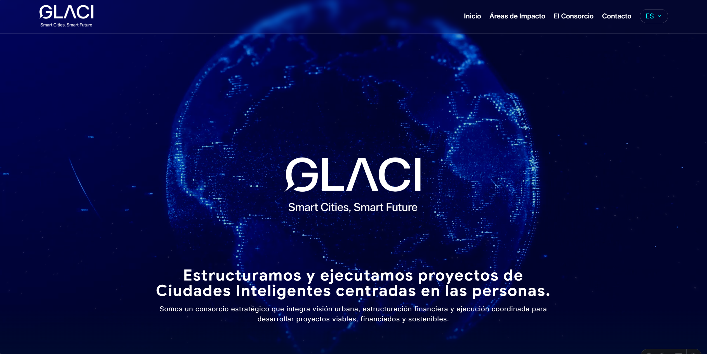
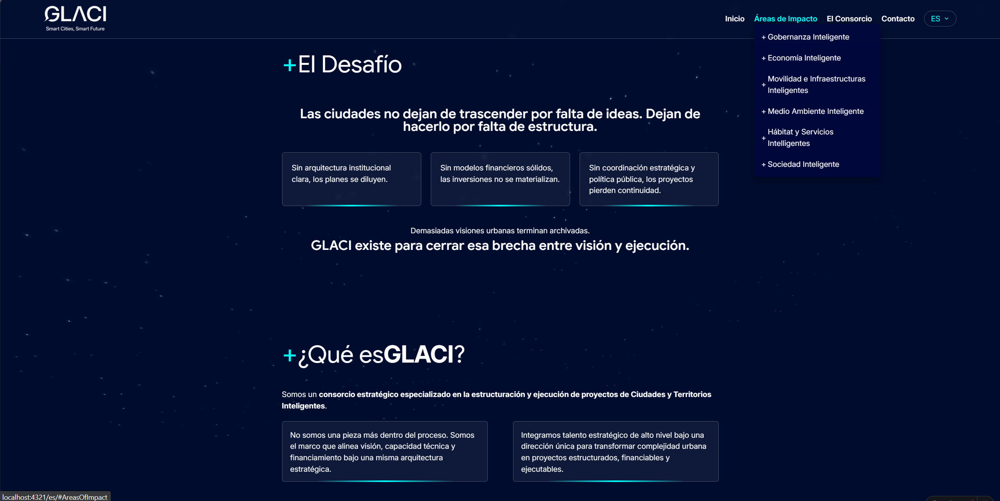
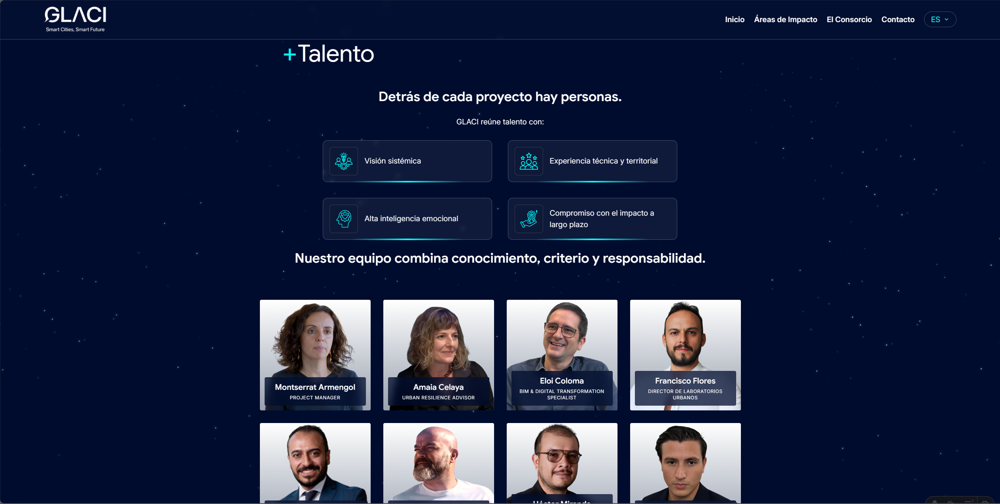

# GLACI — Smart Cities Platform

Sitio web del consorcio GLACI, construido con **Astro**, **Tailwind CSS** y un servidor de correo Express. Soporta 5 idiomas: `es`, `en`, `fr`, `de`, `zh`.

Capturas del sitio





---

## Estructura del proyecto

```
src/
├── api/              # Servidor Express para envío de correos
├── components/       # Componentes Astro reutilizables
├── i18n/             # Sistema de internacionalización
│   └── translations/ # Archivos JSON por idioma
├── layouts/          # Layout base HTML
├── pages/            # Páginas y rutas dinámicas
├── scripts/          # Scripts JS del cliente
└── styles/           # Estilos globales y animaciones
```

---

## API — `src/api/`

### `mail.js`
Servidor **Express** independiente que gestiona el envío de correos SMTP.

| Endpoint | Método | Descripción |
|---|---|---|
| `/ping` | GET | Healthcheck |
| `/api/contact` | POST | Formulario de contacto general (name, email, message) |
| `/api/register-info` | POST | Formulario de registro de información (name, position, company, email, interest, message) |

- Usa **Nodemailer** para SMTP, **Helmet** para headers de seguridad, **express-rate-limit** para limitar peticiones (60s / 6 req), **validator** para sanitizar entradas y **multer** para procesar `multipart/form-data`.
- Variables de entorno requeridas: `SMTP_HOST`, `SMTP_PORT`, `SMTP_USER`, `SMTP_PASS`, `RECEIVER_EMAIL`, `SITE_NAME`.

### `package.json`
Dependencias del servidor API (CommonJS, puerto 3000 por defecto).

---

## Componentes — `src/components/`

### `Hero.astro`
Sección principal de la página de inicio. Muestra un video de fondo, el logo, textos traducidos y los botones de acción (`Button_MoreInformation`, `Button_Networks`).

### `Navbar.astro`
Barra de navegación fija (`position: fixed`). Incluye:
- Menú desktop con dropdown de Áreas de Impacto.
- Menú mobile con overlay full-screen.
- Selector de idioma (`LanguagePicker`).
- Script inline para toggle del menú y submenús.

### `Footer.astro`
Pie de página con botón de scroll-to-top, links de redes sociales (`Button_Networks`), logo y copyright dinámico con año actual.

### `AreasOfImpact.astro`
Diagrama hexagonal SVG interactivo (desktop) que muestra los 6 nodos del ecosistema inteligente. Cada nodo enlaza a su página de área. En mobile muestra una grilla de botones. Incluye tooltip con hover data.

### `Solution_AreasOfImpact.astro`
Variante del diagrama hexagonal para la página `/areas`. Misma lógica que `AreasOfImpact` pero con datos de `AREAS_2` (integrado para exposición).

### `SmartEcosystem.astro`
Hero de cada página de área individual. Muestra el título y descripción del área, con una esfera de partículas 3D animada (Three.js vía CDN Skypack) que reacciona al movimiento del mouse.

### `Areas.astro`
Sección de "Enfoque" dentro de la página de un área. Renderiza dos columnas (`AREA1`, `AREA2`) con los puntos clave de cada área, y el botón `Button_MoreInformation`.

### `Service.astro`
Sección "Qué Habilitamos" de una página de área. Muestra tarjetas de servicios con ícono, título y descripción.

### `SuccessStories.astro`
Sección "Experiencia / Casos" de una página de área. Lista proyectos con imagen(es), título, año, ubicación y descripción. Incluye modal de imagen al hacer clic.

### `Challenge.astro`
Sección "El Desafío" en la home. Muestra 3 tarjetas con los problemas que GLACI resuelve y dos textos de cierre.

### `Glaci.astro`
Sección "¿Qué es GLACI?" con descripción del consorcio y dos tarjetas de texto.

### `Methodology.astro`
Sección "Nuestra Metodología" con tarjetas de las 3 fases del proceso de GLACI y botón CTA.

### `OurModel.astro`
Sección "Modelo integral en 4 fases". Desktop: timeline horizontal con numeración flotante. Mobile: timeline vertical. Incluye textos rotativos animados al final.

### `Value.astro`
Sección "Propuesta de Valor". Grid de ítems con icono y texto, más mensajes centrales animados con AOS.

### `Differentiation.astro`
Sección "Diferenciación" con lista de puntos y una imagen con efecto 3D tilt (`card3d.js`).

### `Vision.astro`
Sección "Visión" con texto principal y grid de tarjetas 3D (si existen en la traducción).

### `Work.astro`
Sección "Colaboramos con" con lista de tipos de clientes e imagen con efecto 3D tilt.

### `Information.astro`
Sección de Misión, Visión y Valores con iconos.

### `Governance.astro`
Sección de Gobernanza con múltiples bloques de texto, tarjetas con icono y listas de ítems.

### `Team.astro`
Sección del equipo del consorcio. Muestra tarjetas de directores con foto, nombre y cargo. Al hacer clic navega a `/consortium/[slug]`. Los miembros se ordenan alfabéticamente por apellido.

### `CompConsortium.astro`
Sección introductoria del consorcio con título, descripción y dos tarjetas de texto.

### `Contact.astro`
Formulario de contacto inline (name, email, message) que hace `POST` a `https://glaci.city/api/contact` con validación cliente.

### `RegisterInfo.astro`
Formulario de registro de información (name, position, company, email, interest, message) con animación de "brillo" en el botón durante el envío. Hace `POST` a `https://glaci.city/api/register-info`.

### `Stars.astro`
Fondo decorativo con 480 elementos `<b>` animados en 3D CSS que simulan un campo de estrellas giratorio (16 paneles × 30 estrellas).

---

## Botones — `src/components/Button_*.astro`

| Componente | Destino | Descripción |
|---|---|---|
| `Button_MoreInformation` | `/{lang}/register` | CTA principal con ícono de flecha y efecto shine |
| `Button_StrategicConversation` | `/{lang}/register` | Botón blanco con hover de color |
| `Button_Certifications` | `/{lang}/certifications` | Igual estilo que MoreInformation |
| `Button_Networks` | externos | Íconos de redes sociales desde `i18n.NETWORKS` |

---

## Internacionalización — `src/i18n/`

### `config.ts`
Define los idiomas soportados (`es`, `en`, `fr`, `zh`, `de`), el idioma por defecto (`es`) y carga los JSON de traducción de forma lazy.

### `utils.ts`
Funciones de utilidad:
- `getLangFromUrl(url)` — extrae el idioma de la URL.
- `useTranslation(lang)` — carga el JSON del idioma.
- `slugify(input)` — convierte texto a slug URL-friendly (normaliza acentos, minúsculas, guiones).
- `sanitizeTranslations(input)` — limpia HTML dejando solo tags permitidos (`strong`, `br`, `em`, `i`, `b`).
- `interpolate(localizedString, referenceString)` — interpola tags HTML numerados en traducciones.

### `index.ts`
Re-exporta todo de `utils` y `config`.

### `LanguagePicker.astro`
Dropdown de selección de idioma. Detecta la ruta actual, resuelve el slug equivalente en el idioma destino y genera los links correctos para cada idioma.

### `Trans.astro`
Componente para renderizar traducciones con HTML embebido. Usa `interpolate` o `sanitizeTranslations` según si tiene slot.

### `translations/`
JSON con todas las claves de UI por idioma. Estructura principal:

| Clave | Contenido |
|---|---|
| `NAVBAR` | Textos del menú |
| `HERO` | Textos y botones del hero |
| `CHALLENGE` | Sección El Desafío |
| `OUR_MODEL` | Modelo de 4 fases |
| `VALUE` | Propuesta de valor |
| `DIFFERENTIATION` | Sección diferenciación |
| `VISION` | Sección visión con tarjetas |
| `AREAS` | Datos de las 6 áreas de impacto (servicios, proyectos, hover) |
| `AREAS_2` | Variante de áreas para página `/areas` |
| `GLACI` | Descripción y metodología |
| `WORK` | Con quién colaboramos |
| `CONSORTIUM` | Textos del consorcio |
| `GOVERNANCE` | Sección gobernanza |
| `TEAM` | Perfiles del equipo |
| `INFORMATION` | Misión, Visión, Valores |
| `CERTIFICATIONS` | Certificaciones ISO |
| `CONTACT_FORM` | Formulario de contacto |
| `REGISTER_INFORMATION` | Formulario de registro |
| `NETWORKS` | Links de redes sociales |
| `FOOTER` | Textos del footer |

---

## Layout — `src/layouts/`

### `Layout.astro`
Layout HTML base. Incluye:
- Meta SEO, viewport, favicon.
- Fuentes Google: `Google Sans`, `Inter`, `Public Sans`.
- Variables CSS globales de colores (tema azul oscuro / cian).
- Componentes globales: `Navbar`, `Footer`, `Stars` (fondo).
- Inicialización de **AOS** (Animate On Scroll) al cargar.
- Estilos responsive en 3 breakpoints: SM (<768px), MD (768-1023px), LG (≥1024px).

---

## Páginas — `src/pages/`

| Ruta | Archivo | Descripción |
|---|---|---|
| `/` | `index.astro` | Redirect implícito (home sin idioma) |
| `/{lang}/` | `[lang]/index.astro` | Home con todas las secciones |
| `/{lang}/areas` | `[lang]/areas.astro` | Vista general de áreas de impacto |
| `/{lang}/{slug}` | `[lang]/[slug].astro` | Página individual de cada área (generada estáticamente desde `AREAS.SMART_ECOSYSTEM_ITEMS`) |
| `/{lang}/consortium` | `[lang]/consortium.astro` | Página del consorcio y equipo |
| `/{lang}/consortium/{slug}` | `[lang]/consortium/[slug].astro` | Perfil individual de cada miembro del equipo |
| `/{lang}/certifications` | `[lang]/certifications.astro` | Página de certificaciones ISO con navegación por tabs |
| `/{lang}/register` | `[lang]/register.astro` | Formulario de registro de información |

Todas las rutas dinámicas usan `getStaticPaths()` para generar las páginas en build time para cada idioma.

---

## Scripts — `src/scripts/`

### `card3d.js`
Efecto 3D tilt en tarjetas. Escucha `mousemove` sobre elementos `.card-3d-wrapper` y aplica `rotateX`/`rotateY` + variables CSS `--mouse-x`, `--mouse-y`, `--angle` al `.card-3d` hijo. Revierte en `mouseleave`.

---

## Estilos — `src/styles/`

### `globals.css`
Importa Tailwind CSS v4 (`@import "tailwindcss"`).

### `nuevo.css`
Librería de animaciones CSS (keyframes): `flash`, `pulse`, `shake`, `bounceIn/Out` (todas direcciones), `fadeIn/Out` (todas direcciones), `flipIn/Out`. Usada por `Stars.astro` e `Information.astro`.

---

## Dependencias principales

| Paquete | Uso |
|---|---|
| Astro | Framework SSG |
| Tailwind CSS v4 | Estilos utilitarios |
| AOS | Animaciones scroll |
| Three.js (CDN) | Esfera de partículas en SmartEcosystem |
| Express 5 | Servidor de correos API |
| Nodemailer | Envío SMTP |
| Helmet / express-rate-limit | Seguridad API |
| validator | Sanitización de inputs |

---

## Variables de entorno (API)

```env
SMTP_HOST=mail.glaci.city
SMTP_PORT=465
SMTP_SECURE=true
SMTP_USER=
SMTP_PASS=
RECEIVER_EMAIL=
SITE_NAME=Glaci City
REJECT_UNAUTHORIZED=true
RATE_LIMIT_WINDOW_MS=60000
RATE_LIMIT_MAX=6
PORT=3000
```
